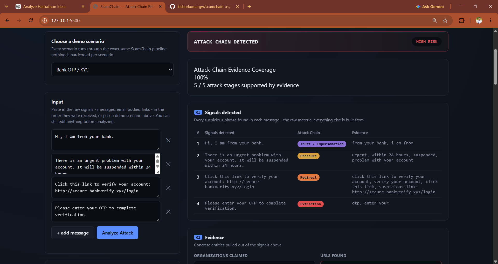
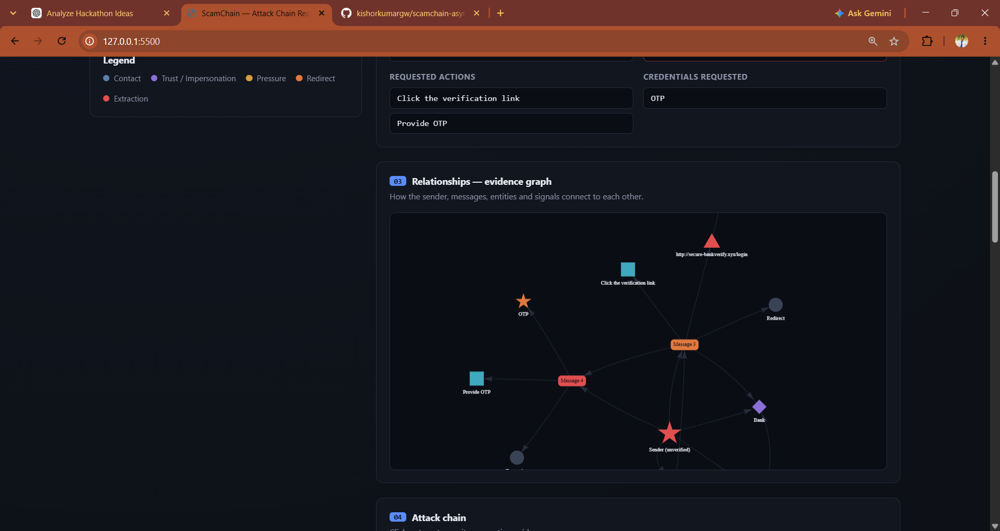
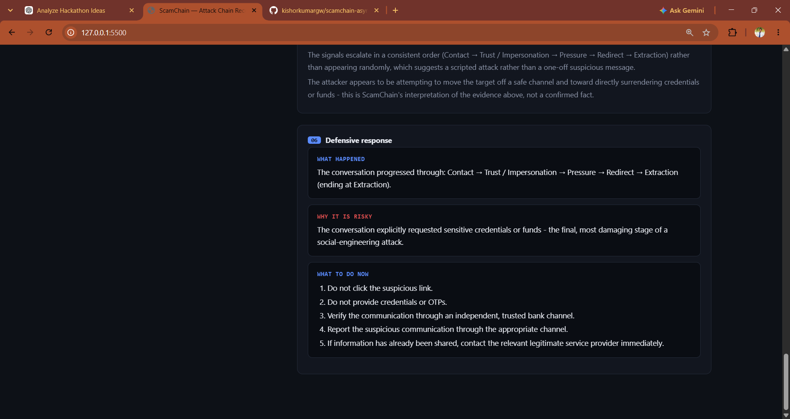
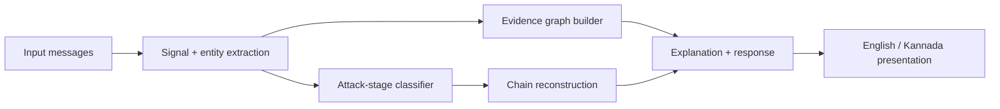

# ScamChain — ASYNC'26

## 1. What is ScamChain?

ScamChain is an explainable **social-engineering attack-chain reconstruction** MVP. It does not simply classify one message as scam/safe. Instead it connects multiple signals, turns them into structured evidence, builds an evidence graph, reconstructs an attack chain, explains the reasoning, and gives a defensive response.


> **Multiple Signals → Evidence → Relationships → Evidence Graph → Attack Chain → Explanation → Defensive Response**
## Demo Screenshots

### 1. Analysis Dashboard

The main ScamChain dashboard shows the submitted messages, detected signals, risk verdict, and attack-chain evidence coverage.



### 2. Evidence Graph & Attack Chain

The evidence graph connects messages, entities, URLs, requested actions, and credentials to reconstruct the social-engineering attack chain.



### 3. Explanation & Defensive Response

ScamChain explains how the signals connect, why the conversation is risky, and what defensive action should be taken.




## 2. Submission mode

This submission is intentionally **self-contained and deterministic**. It does not require Gemini, Claude, an API key, an internet connection for model inference, or any external AI service.

The generative-AI integration that was explored during development was removed from the final MVP to keep the submission reproducible and reliable under hackathon time constraints. The core reconstruction pipeline remains fully functional offline.

## 3. Why this still demonstrates the core innovation

A normal detector often produces:

`Message → Scam / Safe`

ScamChain produces:

`Multiple signals → relationships → evidence graph → attack chain → explanation → defensive response`

The UI makes the core pipeline visible from signal extraction through evidence, relationships/evidence graph, attack-chain reconstruction, explanation, and defensive response.

## 4. How it works



1. **Extraction** (`extractor.py`) identifies suspicious cues, URLs/domains, claimed organizations, requested actions, and credentials.
2. **Stage classification** (`chain_classifier.py`) maps each message to the furthest attack stage supported by its detected evidence.
3. **Evidence graph** (`graph_builder.py`) connects attacker/sender, messages, organizations, URLs/domains, requested actions, and credentials.
4. **Explanation** (`explainer.py`) separates concrete evidence from inference and generates stage-by-stage reasoning, risk level, and defensive guidance.
5. **Presentation** (`i18n.py` + `frontend/i18n.js`) renders the same analysis in English or Kannada.
## 4A. Key Features

- Multi-message social-engineering analysis
- Suspicious signal extraction
- Lightweight entity extraction for organizations, URLs, domains, credentials, and requested actions
- Attack-stage classification
- Multi-message relationship analysis
- Explainable evidence graph
- Chronological attack-chain reconstruction
- Stage-by-stage evidence and reasoning
- Message contribution / turning-point analysis
- Attack timeline visualization
- Defensive response recommendations
- English and Kannada presentation
- Kannada-aware fraud signal detection
- Obfuscation-aware matching such as O.T.P / O T P
- Benign-message false-positive controls
- Offline deterministic execution
- Synthetic evaluation benchmark

## 4B. Technical Implementation

ScamChain uses a lightweight, explainable NLP and rule-based reasoning pipeline.

### Text Processing

- Unicode normalization
- Case and whitespace normalization
- Common scam-message obfuscation normalization
- Regex-based pattern matching
- Keyword and phrase lexicons

### Signal Detection

The extractor identifies signal families including:

- Impersonation
- Urgency / pressure
- Redirect / external-link requests
- Credential or money extraction
- Generic greetings

### Entity Extraction

The system extracts:

- Organizations
- URLs
- Domains
- Credential types
- Requested actions

### Attack-Stage Classification

Each message is mapped to the furthest stage supported by its evidence:

```text
CONTACT
→ TRUST / IMPERSONATION
→ PRESSURE
→ REDIRECT
→ EXTRACTION
## 5. Attack stages

```text
CONTACT → TRUST / IMPERSONATION → PRESSURE → REDIRECT → EXTRACTION
```

The same classifier and graph logic are reused across all demo scenarios; the scenarios are input data, not separate detectors.

## 6. Primary bank demo

The main demo is a synthetic bank/OTP sequence:

1. “Hi, I am from your bank.”
2. “There is an urgent problem with your account.”
3. “Click this link to verify your account: http://secure-bankverify.xyz/login”
4. “Please enter your OTP to complete verification.”

ScamChain reconstructs the chain:

`CONTACT → TRUST / IMPERSONATION → PRESSURE → REDIRECT → EXTRACTION`

The UI then shows the evidence graph, per-stage evidence, timeline, explanation, and defensive response.

## 7. Supported demo scenarios

The repository includes nine fictional scenarios: bank OTP/KYC, UPI payment request, fake customer care, digital arrest, fake job offer, electricity disconnection, courier scam, fake loan app, and investment scam.

All scenario data is synthetic and intended only for awareness/demo use.

## 8. English / Kannada

The UI supports English and Kannada. The backend also contains Kannada-aware signal patterns used by the deterministic extractor. The language choice changes the presentation of the same structured result; it does not require an external translation service.

## 9. Repository structure

```text
backend/
  app/
    extractor.py
    chain_classifier.py
    graph_builder.py
    explainer.py
    i18n.py
    scenarios.py
    models.py
    main.py
  requirements.txt
frontend/
  index.html
  i18n.js
  vendor/vis-network.min.js
evaluation/
  benchmark.py
  run_evaluation.py
  results.json
  results.md
sample_data/
  example_scam_1_bank_otp.json
  example_scam_2_courier.json
PIPELINE_FIXES.md
LICENSE
README.md
SUBMISSION_CHECKLIST.md
```
## Prerequisites

- Python 3.11 or later
- A modern web browser
- No GPU required
- No Node.js installation required for the current frontend
- No external API key required
- No external AI service required

## Environment Variables

The final ScamChain MVP does not require any environment variables, API keys, or external AI services.

| Variable | Required | Default | Description |
|---|---|---|---|
| None | No | — | The submitted core pipeline runs locally without external configuration. |

## 10. How to run locally

### Backend

```bat
cd backend
python -m pip install -r requirements.txt
python -m uvicorn app.main:app --reload --port 8000
```

### Frontend

Open a second terminal:

```bat
cd frontend
python -m http.server 5500
```

Then open `http://127.0.0.1:5500`.

No API key is required.
## API Documentation

The ScamChain backend is implemented with FastAPI.

When the backend is running:

- Swagger UI: `http://127.0.0.1:8000/docs`
- ReDoc: `http://127.0.0.1:8000/redoc`
- Health check: `http://127.0.0.1:8000/health`

## API Usage Example

Send a `POST` request to:

`http://127.0.0.1:8000/analyze`

Example request:

```json
{
  "messages": [
    "Hi, I am from your bank.",
    "There is an urgent problem with your account.",
    "Click this link to verify your account: http://secure-bankverify.xyz/login",
    "Please enter your OTP to complete verification."
  ],
  "lang": "en"
}
```

The response contains the extracted signals, entities, relationships, evidence graph data, attack-chain analysis, explanation, and defensive response.

### Main API endpoint

`POST /analyze`

The `/analyze` endpoint accepts the submitted scam messages and returns the extracted signals, entities, relationships, evidence graph data, attack-chain analysis, explanation, and defensive response.

## 11. Demo flow for judges

1. Open the frontend and confirm **backend connected**.
2. Select **Bank OTP / KYC**.
3. Click **Analyze Attack**.
4. Walk left-to-right through the six visible stages: **Signals → Evidence → Relationships → Attack Chain → Explanation → Response**.
5. Click a chain stage to show its supporting evidence.
6. Point to the evidence graph and timeline to explain how separate messages become one connected attack story.
7. Switch to **ಕನ್ನಡ** to demonstrate the regional-language presentation.

## 12. QA / evaluation
### Evidence Coverage

The UI also displays an **Attack-Chain Evidence Coverage** percentage.

This percentage represents the proportion of the five defined attack stages for which ScamChain has supporting evidence:

```text
CONTACT
→ TRUST / IMPERSONATION
→ PRESSURE
→ REDIRECT
→ EXTRACTION
```
## Benchmark & Maturity

### Synthetic Benchmark

ScamChain includes a local synthetic benchmark covering suspicious and benign cases, including English, Kannada, and obfuscated-message cases.

Latest recorded benchmark results:

| Metric | Result |
|---|---:|
| Suspicious-case pass rate | 100% |
| Required-signal recall | 100% |
| Average chain completeness | 100% |
| Benign false-positive rate | 0% |
| Kannada case pass rate | 100% |
| Obfuscation case pass rate | 100% |

These results come from a small synthetic engineering benchmark and should not be interpreted as real-world accuracy or production performance.

### Maturity Status

**Hackathon MVP / Prototype**

ScamChain is designed for hackathon demonstration, research, and security-awareness use. It is not a production-grade cybersecurity platform.


## Troubleshooting

| Problem | Solution |
|---|---|
| `uvicorn` is not recognized | Run `python -m uvicorn app.main:app --reload --port 8000` from the `backend` folder. |
| Backend does not start | Make sure Python 3.11+ is installed and run `python -m pip install -r requirements.txt`. |
| Frontend cannot connect to the backend | Confirm the backend is running on `http://127.0.0.1:8000` before opening the frontend. |
| Frontend page does not load | Run `python -m http.server 5500` from the `frontend` folder and open `http://127.0.0.1:5500`. |
| Graph is not displayed | Refresh the page after confirming that the backend returned a successful analysis response. |
| API documentation is unavailable | Start the backend first, then open `http://127.0.0.1:8000/docs`. |

## Known Limitations

- The current MVP uses deterministic NLP and rule-based evidence extraction rather than a trained machine-learning model.
- The benchmark is synthetic and does not represent real-world detection accuracy.
- The current attack-chain model focuses on the five defined social-engineering stages.
- URL and message analysis is performed on the data supplied to the application; the MVP does not depend on a live threat-intelligence feed.

## Security Reporting

ScamChain is a hackathon MVP and is not intended for production security operations.

To report a security issue in the project, please open a GitHub issue in the repository with a clear description of the problem and steps to reproduce it. Do not include real passwords, OTPs, financial information, or other sensitive personal data.

## Contributing

Contributions and improvements are welcome.

### Code Style

- Keep the code simple, readable, and modular.
- Preserve the explainability of signal detection and attack-chain reconstruction.
- Avoid adding external services or API dependencies without documenting them.
- Update the README when changes affect setup, usage, architecture, or evaluation.
- Test the local application before submitting changes.

## License

ScamChain is released under the MIT License. See the `LICENSE` file for details.


```bat
p## 5. Attack stages## 
The included synthetic evaluation suite covers 28 cases: 20 suspicious and 8 benign, plus Kannada and obfuscation cases. The latest recorded run reports:

- 100% synthetic suspicious-case pass rate
- 100% required-signal recall
- 100% average chain completeness
- 0% benign false-positive rate
- 100% Kannada case pass rate
- 100% obfuscation case pass rate

These are **synthetic benchmark results**, not claims of real-world accuracy. Re-run the benchmark with:ython evaluation\run_evaluation.py
```

## 13. Limitations

- Detection is deterministic and lexicon-based rather than a trained ML model.
- Novel wording outside the implemented signal patterns can be missed.
- Entity extraction is lightweight rather than full production-grade NER/entity resolution.
- The current graph assumes a single conversation/thread context.
- Demo URLs are fictional placeholders; the system does not perform live URL reputation checks.

## 14. Future scope

Potential extensions include a local ML classifier, stronger entity resolution, multi-sender correlation, live reputation sources, confidence scoring, and optional generative-AI narration. These are intentionally outside the final submission scope.

## Safety notes

The included scenarios are fictional security-awareness examples. They do not contain real credentials, real payment destinations, or operational instructions for committing fraud.

## Reproducibility / disclosure

ScamChain was developed for ASYNC’26 by Team DECODERS.

The initial project concept and baseline prototype were developed before the final hackathon build phase. During the hackathon, the team extended and refined the project substantially, including the explainable evidence graph, attack-chain reconstruction, false-positive handling, Kannada support, evaluation suite, defensive response flow, and final offline demo hardening.

All code included in this repository is submitted under the open-source license included in this repository.

The repository is intended to provide judges with sufficient documentation and source code to understand and reproduce the core ScamChain functionality.
