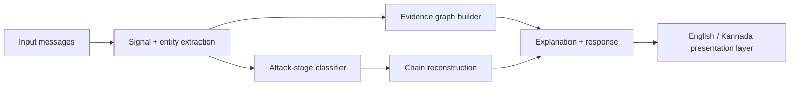

# ScamChain — ASYNC'26

## 1. What is ScamChain?

ScamChain is an explainable system that reconstructs how multiple messages
connect into a social-engineering attack chain. It is **not** presented as
"an AI scam detector" - the point is not a scam/safe label on one message,
it's showing how several signals link together into a story:

> **ONE MESSAGE → a suspicious signal.**
> **MULTIPLE CONNECTED MESSAGES → a reconstructed attack story.**

## 2. Problem

Real scams rarely happen in one message. A victim gets contacted, told
there's a problem, pushed to act urgently, redirected to a link, and only
then asked for an OTP or a payment. Looking at any single message in
isolation, most of that looks almost normal. The danger is in the
*sequence* - and that sequence is exactly what per-message classifiers
throw away.

## 3. Core insight

Instead of `message → scam/safe`, ScamChain does:

```
Multiple signals → relationships → evidence graph → attack chain → explanation → defensive response
```

Every stage of that pipeline is visible in the UI, numbered 01-06, so a
judge (or a real user) can see exactly how ScamChain got from raw text to
a verdict - nothing is a black box.

## 4. How it works



1. **Extraction** (`extractor.py`) - regex/keyword lexicons pull out
   suspicious cues (impersonation, urgency, redirect, extraction asks),
   URLs + domains, organizations claimed, and structured requested-action /
   credential entities. Rule-based on purpose: every flagged signal traces
   back to a concrete phrase, which is what makes the explanation
   trustworthy and lets a judge ask "why did it flag this?" and get a real
   answer.
2. **Stage classification** (`chain_classifier.py`) - each message is
   scored against a 5-stage ladder and also produces `stage_evidence`: a
   mapping from stage to every message that contributed evidence for it
   (used by the clickable attack chain in the UI).
3. **Evidence graph** (`graph_builder.py`) - a `networkx` directed graph
   connecting one **attacker/sender** node, **message/event** nodes,
   **organizations** claimed, **URLs**, **domains**, **requested actions**,
   and **credentials** requested. Kept deliberately small (shared entities
   are deduped into single nodes) so it stays readable rather than
   overcrowded.
4. **Explanation + response** (`explainer.py`) - separates two different
   kinds of claim: **evidence** (concrete facts pulled straight from the
   input) and **inference** (ScamChain's hedged interpretation of what
   those facts add up to - never presented as confirmed fact). Produces a
   risk rating (LOW/MEDIUM/HIGH - no invented percentages), a per-stage
   breakdown (evidence / why it matters / attacker's goal), and a
   structured response (What happened / Why it's risky / What to do now).
5. **Presentation layer** (`i18n.py` + `frontend/i18n.js`) - the analysis
   above is language-independent; only the final rendering step branches
   on the requested language (English or Kannada). See section 8.

## 5. Architecture

```
backend/app/
  extractor.py         signal + entity extraction (language-independent)
  chain_classifier.py  stage classification + chain/stage_evidence
  graph_builder.py     evidence graph (networkx -> node/edge lists)
  explainer.py         evidence/inference, risk, per-stage breakdown, response
  i18n.py              EN/KN dictionaries + render helpers (presentation layer)
  llm.py               optional Claude-narrated overlay - see section 7/9
  scenarios.py          single registry of all 9 demo scenarios
  models.py             pydantic request/response schema
  main.py               FastAPI app: /health /languages /scenarios /analyze
frontend/
  index.html            single-page UI, six numbered pipeline panels
  i18n.js               static UI-chrome translations (headings/buttons/errors)
  vendor/vis-network.min.js   vendored graph library (offline-safe)
sample_data/            two of the scenarios as standalone JSON, for curl testing
```

One backend, not two: `extractor.py` / `chain_classifier.py` /
`graph_builder.py`'s core logic never branches on language. Only `i18n.py`
and the small amount of code in `explainer.py`/`main.py` that calls it are
language-aware.

## 6. Attack stages

```
CONTACT → TRUST / IMPERSONATION → PRESSURE → REDIRECT → EXTRACTION
```

Every scenario (however differently it's framed - a fake job offer, a
fake police call, a fake refund) is mapped onto these same five stages by
the same lexicon. New scam types are added by writing realistic messages
that this shared lexicon already recognizes (plus, occasionally, a few new
lexicon entries) - never by adding a scenario-specific code path. That is
what makes this a general attack-chain reconstructor rather than nine
hardcoded detectors.

## 7. Supported demo scenarios

All nine are entirely fictional (fake names, non-resolving `.xyz`/`.tk`
URLs, no real phone numbers or payment destinations) and written purely
for security-awareness demonstration - see "Safety notes" below.

| Scenario | Typical chain reached |
|---|---|
| Bank OTP / KYC | Trust → Pressure → Redirect → Extraction |
| UPI Payment Request | Trust → Pressure → Extraction (approve, not receive, money) |
| Fake Customer Care | Trust → Pressure → Redirect → Extraction |
| Digital Arrest | Trust → Pressure (incl. isolation tactics) → Extraction |
| Fake Job Offer | Contact → Trust → Pressure → Extraction |
| Electricity Disconnection | Trust → Pressure → Redirect → Extraction |
| Courier Scam | Contact → Pressure → Redirect → Extraction |
| Fake Loan App | Contact → Pressure → Extraction |
| Investment Scam | Trust → Pressure → Extraction |

Pick one from the dropdown in the UI (`GET /scenarios` is the source of
truth) - it populates the input, which you can still edit before
analyzing.

## 8. English / Kannada support

A toggle in the top-right switches the whole UI, live, no reload. Two
different things get translated two different ways:

- **Static UI chrome** (headings, buttons, error messages) - translated
  client-side, instantly, via `frontend/i18n.js`.
- **Analysis-derived text** (evidence descriptions, per-stage explanation,
  risk reasoning, the What happened/Why risky/What to do response) - sent
  to the backend as a `lang` field on `POST /analyze`, and rendered
  server-side by `i18n.py` from the same structured result. If you already
  have results on screen and switch languages, the same messages are
  re-analyzed automatically so you see the language affect the real
  output, not just relabeled buttons.

An unsupported `lang` value falls back to English rather than erroring
(see `i18n.normalize_lang`).

**Limitation:** the extractor's lexicons are English-keyword-based, so
scenario *message content* stays in English regardless of UI language -
that's what the detector actually understands today. Kannada mode
localizes the interface and the explanation of what was found, not the
scam text itself. A future version could add a parallel Kannada lexicon
(and possibly transliteration handling) to detect Kannada-language scam
messages directly - see Limitations below.

## 9. Technology stack

- **Backend:** Python, FastAPI, `networkx` (evidence graph), Pydantic.
  Optional: `anthropic` SDK, only if `ANTHROPIC_API_KEY` is set.
- **Frontend:** a single HTML file, vanilla JS (no build step), vis-network
  (vendored locally, not loaded from a CDN) for the graph visualization,
  Noto Sans Kannada + Space Grotesk for Kannada/Latin text.

No new dependencies were added for this feature set - `networkx` and
`fastapi`/`pydantic`/`uvicorn`/`anthropic` were already in
`requirements.txt` from the original MVP.

## 10. How to run locally

```bash
cd backend
pip install -r requirements.txt
uvicorn app.main:app --reload --port 8000
```

Then open `frontend/index.html` in a browser. The connection indicator at
the top confirms it can reach the backend at `http://127.0.0.1:8000`
(editable in the UI if you deploy the backend elsewhere).

## 11. Example workflow

1. Open the app - the connection indicator shows the backend status.
2. Pick **Bank OTP / KYC** from "Choose a demo scenario" (or type your own
   messages).
3. Click **Analyze Attack**.
4. Read the six numbered panels top to bottom: Signals → Evidence →
   Relationships (graph) → Attack Chain (click a stage for its evidence,
   or scroll the Attack Timeline) → Explanation (per-stage cards) →
   Defensive Response (What happened / Why it's risky / What to do).
5. Toggle **ಕನ್ನಡ** - the same result re-renders in Kannada.

## 12. Limitations

- Detection is a rule-based/lexicon system, not a trained ML model - by
  design (see section 4), but it means novel phrasing outside the
  lexicons won't be flagged. Extending it means adding lexicon entries,
  not retraining anything.
- Scenario message content is English-only; Kannada-language scam text is
  not yet detected (see section 8).
- The evidence graph assumes one attacker/sender per conversation thread -
  correct for every current demo scenario, but would need a "which sender"
  entity-resolution step to handle multiple senders in one input.
- Organization/entity extraction is keyword-spotting, not real NER - a
  bank name that isn't in `ORG_KEYWORDS` won't be recognized as an
  organization (though it will still be picked up by the impersonation/
  urgency/extraction lexicons if it uses those cues).
- The optional AI-narrated overlay (`llm.py`) only ever rewrites the
  narrative text and is never required - if `ANTHROPIC_API_KEY` is unset
  or the call fails for any reason, the deterministic result is what's
  shown. This is intentional (Feature 7 / "do not fake AI").

## 13. Future scope

- A Kannada (or other regional-language) lexicon so scam text itself, not
  just the UI, can be analyzed natively.
- Multi-sender / multi-thread correlation (the same phone number or domain
  reused across different victims' conversations).
- Real entity linking (WHOIS lookups on flagged domains, sender reputation
  scoring) instead of keyword-based organization spotting.
- A confidence score per signal instead of a binary match, feeding into a
  more granular risk rating.

---

## Safety notes

Every scenario in `scenarios.py` is fictional and written only for
security-awareness demonstration: no real people, no functional phishing
links (all URLs use non-resolving `.xyz`/`.tk` placeholder domains), no
real bank/customer-care phone numbers, no real company branding imitated
beyond a generic label ("your bank", "the courier company"), and no
operational fraud instructions of any kind.

## QA

See `PIPELINE_FIXES.md` for the original hardening pass (dependency
pinning, offline-safe graph rendering, input validation) and the changelog
entry there for this feature set (i18n, 9 scenarios, timeline, stage
breakdown) - including exactly how each part was tested.
