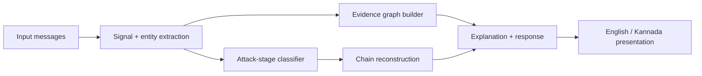

# ScamChain — ASYNC'26

## 1. What is ScamChain?

ScamChain is an explainable **social-engineering attack-chain reconstruction** MVP. It does not simply classify one message as scam/safe. Instead it connects multiple signals, turns them into structured evidence, builds an evidence graph, reconstructs an attack chain, explains the reasoning, and gives a defensive response.

> **Multiple Signals → Evidence → Relationships → Evidence Graph → Attack Chain → Explanation → Defensive Response**

## 2. Submission mode

This submission is intentionally **self-contained and deterministic**. It does not require Gemini, Claude, an API key, an internet connection for model inference, or any external AI service.

The generative-AI integration that was explored during development was removed from the final MVP to keep the submission reproducible and reliable under hackathon time constraints. The core reconstruction pipeline remains fully functional offline.

## 3. Why this still demonstrates the core innovation

A normal detector often produces:

`Message → Scam / Safe`

ScamChain produces:

`Multiple signals → relationships → evidence graph → attack chain → explanation → defensive response`

The UI makes all six pipeline stages visible so judges can trace the result from raw input to the final response.

## 4. How it works



1. **Extraction** (`extractor.py`) identifies suspicious cues, URLs/domains, claimed organizations, requested actions, and credentials.
2. **Stage classification** (`chain_classifier.py`) scores each message against five attack stages and records the evidence contributing to each stage.
3. **Evidence graph** (`graph_builder.py`) connects attacker/sender, messages, organizations, URLs/domains, requested actions, and credentials.
4. **Explanation** (`explainer.py`) separates concrete evidence from inference and generates stage-by-stage reasoning, risk level, and defensive guidance.
5. **Presentation** (`i18n.py` + `frontend/i18n.js`) renders the same analysis in English or Kannada.

## 5. Attack stages

```text
CONTACT → TRUST / IMPERSONATION → PRESSURE → REDIRECT → EXTRACTION
```

The same classifier and graph logic are reused across all demo scenarios; the scenarios are input data, not separate detectors.

## 6. Primary bank demo

The main demo is a synthetic bank/OTP sequence:

1. “Hi, I am from your bank.”
2. “There is an urgent problem with your account.”
3. “Click this link to verify your account: http://secure-bankverify.xyz/login”
4. “Please enter your OTP to complete verification.”

ScamChain reconstructs the chain:

`CONTACT → TRUST / IMPERSONATION → PRESSURE → REDIRECT → EXTRACTION`

The UI then shows the evidence graph, per-stage evidence, timeline, explanation, and defensive response.

## 7. Supported demo scenarios

The repository includes nine fictional scenarios: bank OTP/KYC, UPI payment request, fake customer care, digital arrest, fake job offer, electricity disconnection, courier scam, fake loan app, and investment scam.

All scenario data is synthetic and intended only for awareness/demo use.

## 8. English / Kannada

The UI supports English and Kannada. The backend also contains Kannada-aware signal patterns used by the deterministic extractor. The language choice changes the presentation of the same structured result; it does not require an external translation service.

## 9. Repository structure

```text
backend/
  app/
    extractor.py
    chain_classifier.py
    graph_builder.py
    explainer.py
    i18n.py
    scenarios.py
    models.py
    main.py
  requirements.txt
frontend/
  index.html
  i18n.js
  vendor/vis-network.min.js
evaluation/
  benchmark.py
  run_evaluation.py
  results.json
  results.md
sample_data/
  example_scam_1_bank_otp.json
  example_scam_2_courier.json
PIPELINE_FIXES.md
LICENSE
README.md
SUBMISSION_CHECKLIST.md
```

## 10. How to run locally

### Backend

```bat
cd backend
python -m pip install -r requirements.txt
python -m uvicorn app.main:app --reload --port 8000
```

### Frontend

Open a second terminal:

```bat
cd frontend
python -m http.server 5500
```

Then open `http://127.0.0.1:5500`.

No API key is required.

## 11. Demo flow for judges

1. Open the frontend and confirm **backend connected**.
2. Select **Bank OTP / KYC**.
3. Click **Analyze Attack**.
4. Walk left-to-right through the six visible stages: **Signals → Evidence → Relationships → Attack Chain → Explanation → Response**.
5. Click a chain stage to show its supporting evidence.
6. Point to the evidence graph and timeline to explain how separate messages become one connected attack story.
7. Switch to **ಕನ್ನಡ** to demonstrate the regional-language presentation.

## 12. QA / evaluation

The included synthetic evaluation suite covers 28 cases: 20 suspicious and 8 benign, plus Kannada and obfuscation cases. The latest recorded run reports:

- 100% synthetic suspicious-case pass rate
- 100% required-signal recall
- 100% average chain completeness
- 0% benign false-positive rate
- 100% Kannada case pass rate
- 100% obfuscation case pass rate

These are **synthetic benchmark results**, not claims of real-world accuracy. Re-run the benchmark with:

```bat
python evaluation\run_evaluation.py
```

## 13. Limitations

- Detection is deterministic and lexicon-based rather than a trained ML model.
- Novel wording outside the implemented signal patterns can be missed.
- Entity extraction is lightweight rather than full production-grade NER/entity resolution.
- The current graph assumes a single conversation/thread context.
- Demo URLs are fictional placeholders; the system does not perform live URL reputation checks.

## 14. Future scope

Potential extensions include a local ML classifier, stronger entity resolution, multi-sender correlation, live reputation sources, confidence scoring, and optional generative-AI narration. These are intentionally outside the final submission scope.

## Safety notes

The included scenarios are fictional security-awareness examples. They do not contain real credentials, real payment destinations, or operational instructions for committing fraud.

## Reproducibility / disclosure

ScamChain was developed for ASYNC’26 by Team DECODERS.

The initial project concept and baseline prototype were developed before the final hackathon build phase. During the hackathon, the team extended and refined the project substantially, including the explainable evidence graph, attack-chain reconstruction, false-positive handling, Kannada support, evaluation suite, defensive response flow, and final offline demo hardening.

All code included in this repository is submitted under the open-source license included in this repository.

The repository is intended to provide judges with sufficient documentation and source code to understand and reproduce the core ScamChain functionality.
